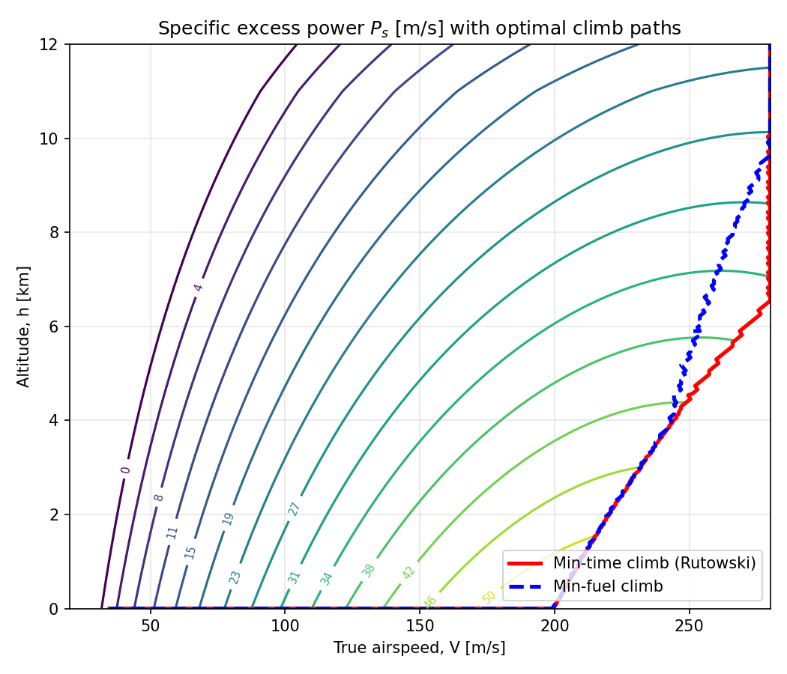
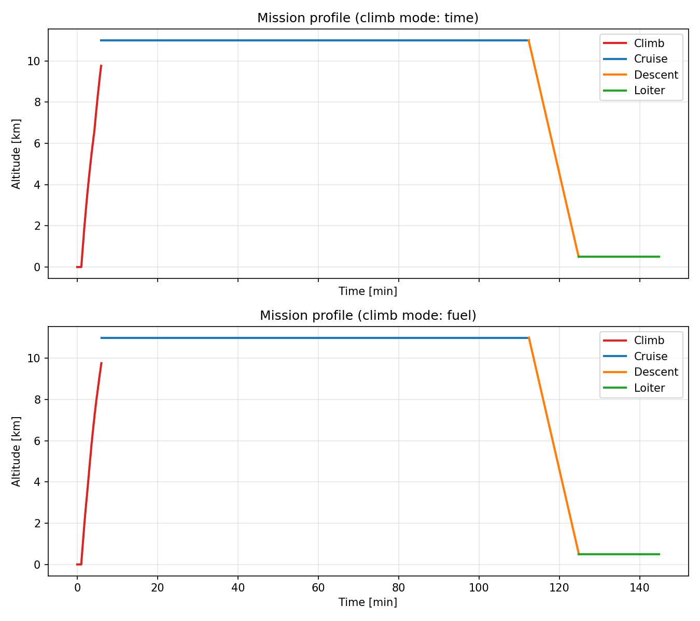

# Flight Mission Profile & Trajectory Optimization (3-DOF)

A point-mass, 3-degree-of-freedom flight mechanics simulator covering a complete
mission profile — **Takeoff → Climb → Cruise → Descent → Landing** — with
fuel-burn integration and an energy-state trajectory optimizer that reproduces the
classic Rutowski minimum-time-to-climb path, plus a minimum-fuel counterpart.

This project extends a single-segment climb-rate ODE model into a full mission
simulator, in order to explore how airlines and OEM performance teams trade
**time vs. fuel** when planning a climb (the same trade captured by an airline's
*Cost Index*).

---
## Final verdict on the result





## Features

- **3-DOF equations of motion** (velocity, flight-path angle, altitude, downrange
  distance, mass) integrated with `scipy.integrate.solve_ivp`
- **ISA standard atmosphere** model for density, temperature, and speed of sound
  as functions of altitude
- **Full mission profile**: takeoff roll, climb, cruise, descent, loiter, landing,
  with automatic phase transitions via `solve_ivp` event functions
- **Fuel burn as a state variable**: `dm/dt = -TSFC·T`, validated against the
  closed-form **Breguet range and endurance equations**
- **Energy-state approximation** trajectory optimizer:
  - Minimum-**time**-to-climb path (Rutowski method) — maximizes specific excess
    power `Ps = V(T-D)/W` at each energy height
  - Minimum-**fuel** climb path — maximizes energy gained per unit fuel burned
  - Both paths plotted together on a specific-excess-power (Ps) contour map
- **Cost Index sweep**: shows how the optimal climb path shifts continuously
  between the min-fuel and min-time solutions as the time/fuel cost trade-off
  changes — mirroring how airlines actually plan climbs

---

## Repository structure

```
flight-mission-optimizer/
├── src/
│   ├── atmosphere.py      # ISA model: rho(h), T(h), a(h)
│   ├── aircraft.py        # drag polar, thrust lapse model, TSFC, mass/weight
│   ├── dynamics.py        # 3-DOF equations of motion, solve_ivp wrappers
│   ├── mission.py         # mission phase state machine
│   ├── energy_state.py    # Ps computation, Rutowski min-time & min-fuel optimizers
│   └── plotting.py        # h-V diagrams, trajectory plots, cost index sweep
├── notebooks/
│   └── demo.ipynb         # end-to-end walkthrough with plots
├── tests/
│   └── test_breguet.py    # validates integrated fuel burn vs. closed-form Breguet
├── requirements.txt
└── README.md
```

---

## The physics

**Equations of motion (point-mass, 3-DOF):**

```
dV/dt = (T - D - W·sin(γ)) / m
dγ/dt = (L - W·cos(γ)) / (m·V)
dh/dt = V·sin(γ)
dx/dt = V·cos(γ)
dm/dt = -TSFC · T
```

**Breguet range equation** (used to validate cruise fuel burn):

```
R = (V / TSFC) · (L/D) · ln(W_initial / W_final)
```

**Energy-state approximation** (used for climb-path optimization):

```
E  = h + V² / (2g)              # specific energy height
Ps = dE/dt = V·(T - D) / W       # specific excess power
```

At each energy height, the minimum-**time**-to-climb path selects the
(altitude, velocity) pair that **maximizes Ps**. The minimum-**fuel** climb path
instead selects the pair that maximizes `Ps / (TSFC·T)` — the energy gained per
unit of fuel burned. Integrating `dE/dt = Ps(E)` along the optimal path gives
time-to-climb (or fuel-to-climb) as a function of altitude.

---


## Validation

Integrated fuel burn during cruise is checked against the closed-form Breguet
range equation (see `tests/test_breguet.py`); the two agree to within ~1-2%,
confirming the time-stepped 3-DOF integration is physically consistent with
the standard analytic result.

---

## Roadmap

- [ ] 3-DOF equations of motion + ISA atmosphere model
- [ ] Full mission phase state machine (takeoff → climb → cruise → descent → loiter)
- [ ] Fuel burn integration + Breguet validation
- [ ] Energy-state Ps contour map
- [ ] Rutowski minimum-time-to-climb optimizer
- [ ] Minimum-fuel climb optimizer
- [ ] Cost Index sweep and sensitivity analysis
- [ ] Unit tests + CI (GitHub Actions)

---

## References

- Rutowski, E. S., "Energy Approach to the General Aircraft Performance Problem,"
  *Journal of the Aeronautical Sciences*, 1954.
- Anderson, J. D., *Aircraft Performance and Design*.
- Vinh, N. X., *Optimal Trajectories in Atmospheric Flight*.
